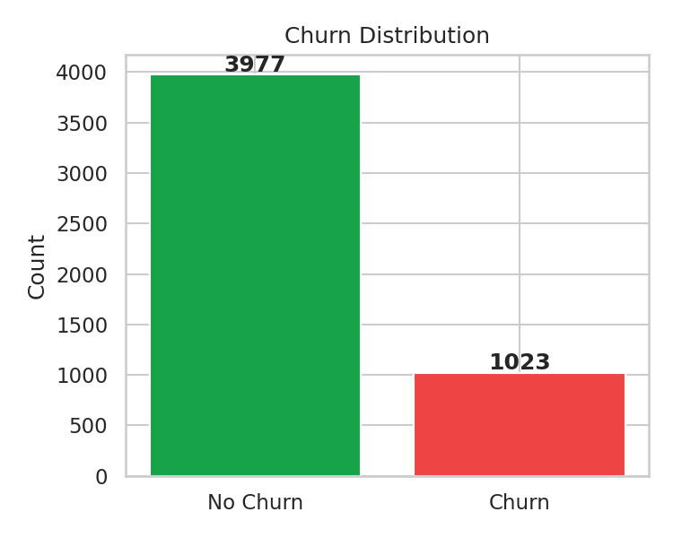
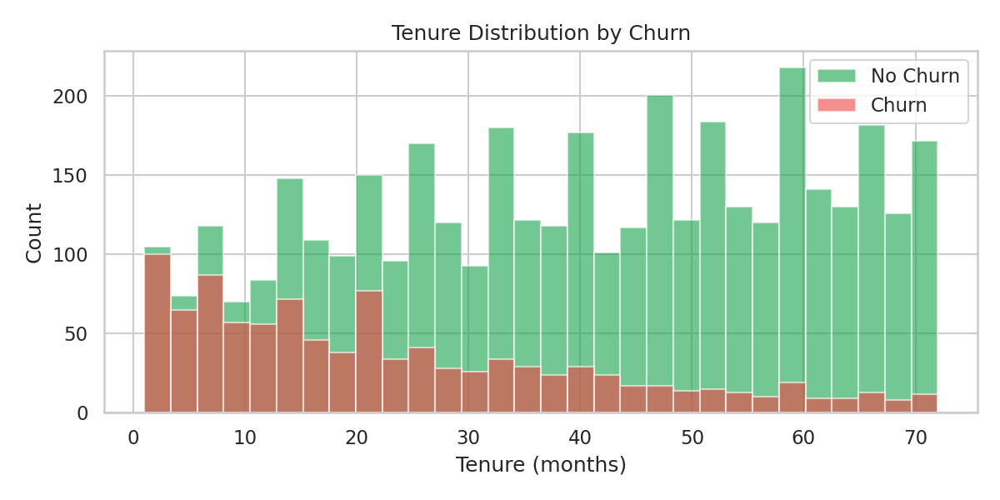
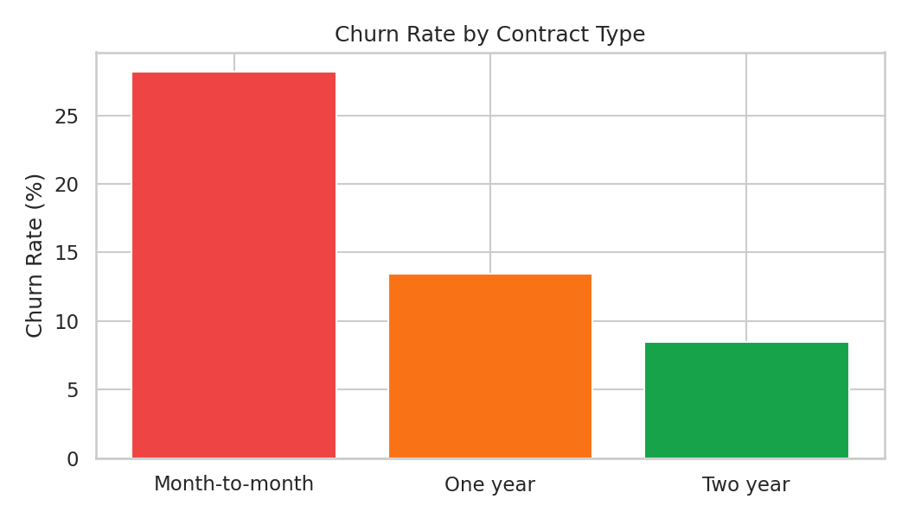
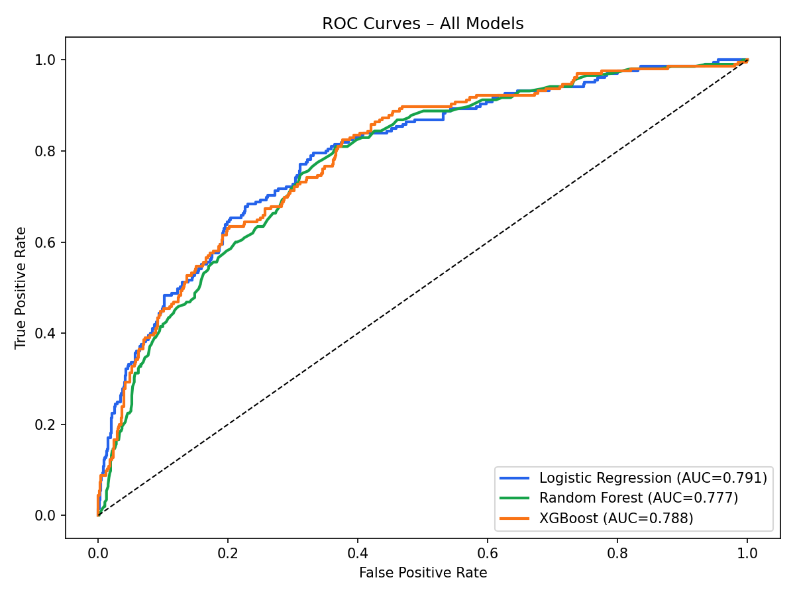
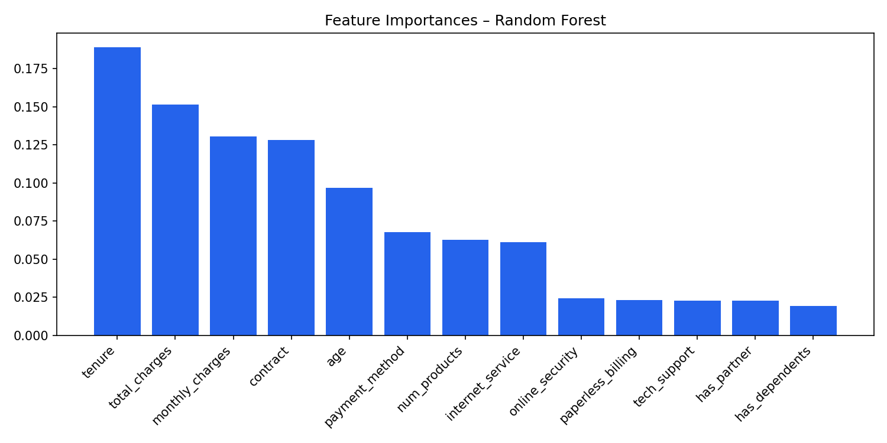
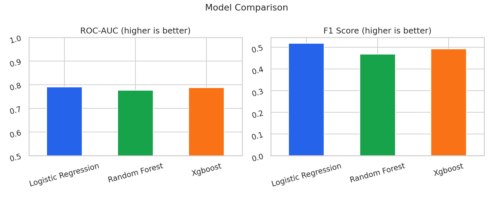

# Customer Churn Prediction – Classification & Business Analytics


Predict customer churn using Logistic Regression, Random Forest, and XGBoost — with SMOTE to handle class imbalance, ROC curve comparison, and actionable business recommendations.

---

## Project Overview

Customer churn costs businesses significantly more than retaining existing customers. This project builds a churn prediction pipeline on synthetic telecom data and translates model outputs into concrete retention strategies.

| Model | Type | Key Strength |
|---|---|---|
| Logistic Regression | Linear | Interpretable baseline, fast to train |
| Random Forest | Ensemble | Handles non-linearity, feature importance |
| XGBoost | Gradient Boosting | Best overall performance, robust to imbalance |

**Class imbalance** (~20% churn rate) is handled with **SMOTE** (Synthetic Minority Oversampling Technique) on the training set only.

---

## Results

| Model | ROC-AUC | F1 Score |
|---|---|---|
| Logistic Regression | 0.791 | 0.518 |
| Random Forest | 0.777 | 0.467 |
| XGBoost | 0.788 | 0.491 |

---

## Repository Structure

```
customer-churn/
│
├── data/
│   ├── sample/
│   │   └── customer_data.csv            # 5,000 synthetic telecom customers
│   └── generate_sample_data.py          # Reproducible data generator
│
├── notebooks/
│   └── EDA_and_Modelling.ipynb          # Full walkthrough + business recommendations
│
├── src/
│   ├── preprocess.py                    # Encoding, scaling, SMOTE
│   └── train_models.py                  # LR, RF, XGBoost training + plots
│
├── results/
│   ├── plots/
│   │   ├── churn_distribution.png
│   │   ├── tenure_vs_churn.png
│   │   ├── charges_vs_churn.png
│   │   ├── contract_churn_rate.png
│   │   ├── roc_curves.png
│   │   ├── feature_importance.png
│   │   ├── cm_logistic_regression.png
│   │   ├── cm_random_forest.png
│   │   ├── cm_xgboost.png
│   │   └── model_comparison.png
│   └── metrics/                         # JSON classification reports per model
│
├── requirements.txt
└── README.md
```

---

## Visualisations

### Churn Distribution


### Tenure vs Churn


### Churn Rate by Contract Type


### ROC Curves – All Models


### Feature Importances – Random Forest


### Model Comparison


---

## Quickstart

```bash
# 1. Clone the repository
git clone https://github.com/kishansheladiya/customer-churn.git
cd customer-churn

# 2. Install dependencies
pip install -r requirements.txt

# 3. Generate sample data
python data/generate_sample_data.py

# 4. Train all models
cd src
python train_models.py

# 5. Or explore interactively
jupyter notebook notebooks/EDA_and_Modelling.ipynb
```

---

## Dataset

Synthetic telecom customer data with realistic churn patterns:

| Feature | Description |
|---|---|
| `tenure` | Months as a customer (1–72) |
| `monthly_charges` | Monthly bill amount |
| `total_charges` | Total spend to date |
| `contract` | Month-to-month / One year / Two year |
| `internet_service` | DSL / Fiber optic / No |
| `online_security` | Has online security add-on |
| `tech_support` | Has tech support add-on |
| `payment_method` | Electronic check / Credit card / etc. |
| `churn` | Target: 1 = churned, 0 = retained |

- **5,000 customers** | **~20% churn rate**
- Churn probability driven by contract type, tenure, charges, and service features

---

## Business Recommendations

Based on feature importance and model analysis:

- **Month-to-month contracts** → highest churn risk; offer loyalty discounts for annual upgrades
- **High charges + short tenure** → price-sensitive new customers; consider onboarding discounts
- **Fiber optic without security/support** → upsell bundled service packages
- **Electronic check payment** → correlates with churn; encourage auto-pay enrollment

---

## Tech Stack

- **Python 3.10+**
- **Pandas / NumPy** — data processing
- **Scikit-learn** — Logistic Regression, Random Forest, metrics
- **XGBoost** — gradient boosting classifier
- **imbalanced-learn** — SMOTE oversampling
- **Matplotlib / Seaborn** — visualisation

---

## Author

**Kishan Sheladiya**  
M.Sc. Mathematical Modelling, Simulation & Optimization — Universität Koblenz  
[kishansheladiya.de](https://kishansheladiya.de) · [LinkedIn](https://linkedin.com/in/kishan-sheladiya) · [GitHub](https://github.com/kishansheladiya)
